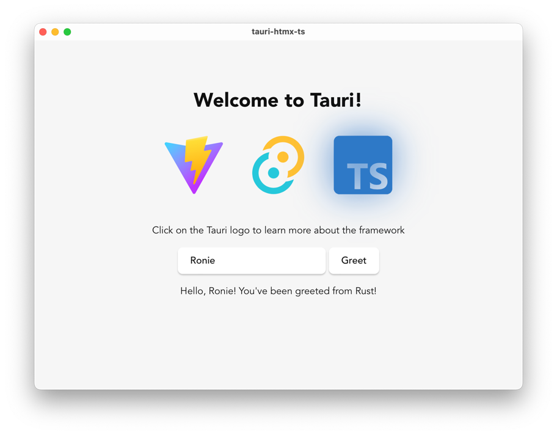
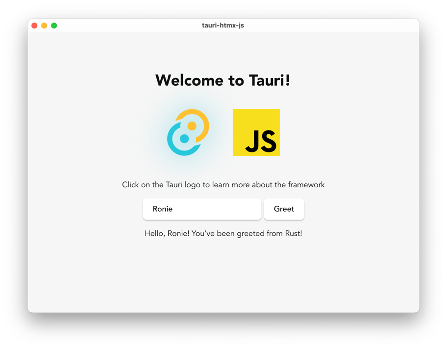

# tauri-plugin-htmx

htmx plugin for Tauri

## How it works

`tauri-plugin-htmx` works by creating a fake ajax response by patching [`XMLHttpRequest.send()`](https://developer.mozilla.org/en-US/docs/Web/API/XMLHttpRequest/send).

## How to use

1. Start a Tauri project using [`create-tauri-app`](https://tauri.app/v1/guides/getting-started/setup/) and choosing "Vanilla" Javascript/Typescript as frontend.
    ```bash
   $ cargo create-tauri-app                                                  
    ✔ Project name · tauri-htmx-ts
    ✔ Choose which language to use for your frontend · TypeScript / JavaScript - (pnpm, yarn, npm, bun)
    ✔ Choose your package manager · npm
    ✔ Choose your UI template · Vanilla
    ✔ Choose your UI flavor · TypeScript
   
   Template created! To get started run:
    cd tauri-htmx-ts
    npm install
    npm run tauri dev
    ```
2. Install [htmx](https://github.com/bigskysoftware/htmx)
    ```bash
    npm i htmx.org
    ```
3. Install `tauri-plugin-htmx`
    ```bash
   npm i tauri-plugin-htmx
    ```
4. Modify the form in `index.html` to use `htmx`. Instead of using a URL in `hx-post` (or `hx-get`), use the command name prefixed with `command:` (e.g. `command:greet`).
   ```diff
   -      <form class="row" id="greet-form">
   -        <input id="greet-input" placeholder="Enter a name..." />
   -        <button type="submit">Greet</button>
   -      </form>
   +      <div class="row">
   +        <input id="greet-input" name="name" placeholder="Enter a name..." />
   +        <button hx-post="command:greet" hx-include="[name='name']" hx-trigger="click" hx-target="#greet-msg" hx-swap="innerHTML">Greet</button>
   +      </div>
   ```
5. Add meta tag in `index.html`.
   ```diff
   +     <meta name="htmx-config" content='{"selfRequestsOnly":false}' />
   ```
6. Modify `main.ts` or `main.js` removing everything and replacing it with just `htmx` and `tauri-plugin-htmx` imports.
   ```typescript
   // main.ts
   import "htmx.org";
   import "tauri-plugin-htmx";
   ```

   If you are using JavaScript as frontend, you need to copy the JS files from `node_modules`.
   ```bash
   cp node_modules/htmx.org/dist/htmx.min.js src
   cp node_modules/tauri-plugin-htmx/tauri-plugin-htmx.js src
   ```
   
   Importing will be a little different.
   ```javascript
   // main.js
   import "./htmx.min.js";
   import "./tauri-plugin-htmx.js";
   ```
   
7. Run your Tauri app
   ```bash
   cargo tauri dev
   ```
   
   
   

## Author

[Ronie Martinez](mailto:ronmarti18@gmail.com)
